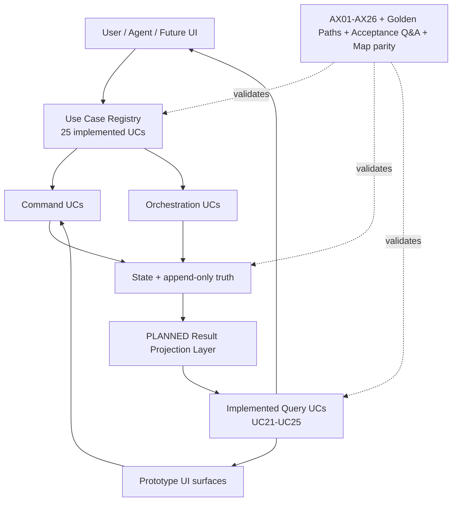

# System Map — current implementation + planned result/query overlay

Generated from system **1.11.0**, Use Case Registry **3.2.0**, contract **3.1.0**, Golden Path Registry **1.0.0**, acceptance model **1.1.0**.

## 1. High-level architecture

## 2. Implemented use-case topology

Implemented UCs: **25**. Groups: `acquisition`=4, `analysis`=6, `governance`=1, `lifecycle`=6, `maintenance`=3, `results`=5. Interactions: `command`=14, `orchestration`=6, `query`=5. Execution owners: `application`=6, `development`=1, `internal`=2, `mixed`=8, `research_agent`=8.

| UC | Group | Interaction | Execution owner | Inputs | Outputs | Reads | Writes | Capabilities | Next |
|---|---|---|---|---:|---:|---:|---:|---:|---|
| UC01 Start a new research project | lifecycle | orchestration | `application` | 1 | 1 | 2 | 5 | 2 | UC03, UC18 |
| UC02 Continue from previous research | lifecycle | orchestration | `mixed` | 1 | 2 | 2 | 3 | 2 | UC01, UC03, UC18 |
| UC03 Execute the next atomic task | lifecycle | orchestration | `research_agent` | 1 | 1 | 4 | 3 | 3 | UC17, UC18 |
| UC04 Discover candidate channels and sources | acquisition | command | `research_agent` | 1 | 1 | 2 | 1 | 2 | UC05, UC15, UC17 |
| UC05 Verify one channel/source/mechanism | acquisition | command | `research_agent` | 1 | 1 | 2 | 3 | 1 | UC06, UC11, UC15 |
| UC06 Observe what paid work is being bought | acquisition | command | `research_agent` | 1 | 1 | 2 | 2 | 2 | UC07, UC18 |
| UC07 Normalize and clean observed work | analysis | command | `mixed` | 1 | 1 | 2 | 1 | 2 | UC06, UC08 |
| UC08 Measure one dimension | analysis | command | `mixed` | 2 | 1 | 3 | 2 | 2 | UC08, UC11, UC14 |
| UC09 Monitor known scope over time | maintenance | command | `mixed` | 2 | 1 | 3 | 4 | 4 | UC16, UC17, UC18 |
| UC10 Rediscover novelty beyond the baseline | acquisition | command | `research_agent` | 1 | 1 | 2 | 2 | 2 | UC04, UC17 |
| UC11 Triangulate one claim | analysis | command | `research_agent` | 1 | 1 | 1 | 2 | 2 | UC11, UC14 |
| UC12 Run a practical delivery test | analysis | command | `research_agent` | 1 | 1 | 2 | 2 | 2 | UC08, UC14 |
| UC13 Run a market/acquisition test | analysis | command | `research_agent` | 1 | 1 | 2 | 2 | 1 | UC14, UC18 |
| UC14 Filter, compare and update the decision | analysis | command | `mixed` | 1 | 1 | 1 | 2 | 3 | UC08, UC12, UC13, UC17 |
| UC15 Manage research sources | maintenance | command | `mixed` | 1 | 1 | 1 | 4 | 4 | UC05, UC17 |
| UC16 Change a method or project policy safely | maintenance | command | `mixed` | 1 | 1 | 3 | 4 | 1 | UC17, UC18, UC20 |
| UC17 Checkpoint and hand off | lifecycle | orchestration | `mixed` | 1 | 1 | 3 | 5 | 1 | UC03 |
| UC18 Repair and reconcile a project | lifecycle | orchestration | `internal` | 1 | 1 | 2 | 2 | 2 | UC03, UC20 |
| UC19 Audit or modify the reusable system | governance | command | `development` | 1 | 1 | 2 | 4 | 2 | UC16, UC19 |
| UC20 Migrate a project to a newer system contract | lifecycle | orchestration | `internal` | 1 | 1 | 2 | 4 | 2 | UC03, UC18 |
| UC21 Get Current State | results | query | `application` | 2 | 1 | 2 | 0 | 1 | terminal |
| UC22 Get Changes | results | query | `application` | 2 | 1 | 2 | 0 | 1 | terminal |
| UC23 Get Trend | results | query | `application` | 4 | 1 | 2 | 0 | 1 | terminal |
| UC24 Get Interpretation | results | query | `application` | 3 | 1 | 2 | 0 | 1 | terminal |
| UC25 Get Research Health | results | query | `application` | 1 | 1 | 2 | 0 | 1 | terminal |

## 3. Current Golden Paths

- **GP01 Start new project**: `UC01 → UC03`
- **GP02 Continue previous baseline**: `UC02 → UC03`
- **GP03 Paid-work research pipeline**: `UC06 → UC07 → UC08 → UC14 → UC17`
- **GP04 Daily monitoring and diff**: `UC09 → UC17`
- **GP05 Add and persist a research source**: `UC15 → UC17`
- **GP06 Method change requiring migration**: `UC16 → UC20 → UC03`

## 4. Result/query plane

UC21–UC25 are implemented as **read-only query contracts** in Phase 2. Their typed result-product contracts exist, while projection/build execution remains planned for Phase 3.

- `UC21 Get Current State` → `CurrentStateSnapshot`; writes=0; UI: Current State, Direction Detail
- `UC22 Get Changes` → `ChangeSet`; writes=0; UI: Daily Changes, Direction Detail
- `UC23 Get Trend` → `TrendSeries`; writes=0; UI: Trends, Direction Detail
- `UC24 Get Interpretation` → `InterpretationRecord`; writes=0; UI: Interpretations
- `UC25 Get Research Health` → `ResearchHealthSnapshot`; writes=0; UI: Coverage & Quality, Direction Detail

Projection backend status: `planned_phase3`.

## 5. UI composition overlay

- **Current State** → queries UC21; command actions UC09, UC08
- **Direction Detail** → queries UC21, UC22, UC23, UC25; command actions UC09, UC08
- **Daily Changes** → queries UC22; command actions UC09
- **Trends** → queries UC23; command actions UC08
- **Interpretations** → queries UC24; command actions UC11, UC08
- **Coverage & Quality** → queries UC25; command actions UC09, UC08, UC18

## 6. Assurance and map maintenance

- Audit axes: **26** (`AX01–AX26`).
- Golden Paths: **6**.
- Acceptance uses explicit phase criteria **plus** pre-execution/emergent questions and post-execution answers.
- `REFERENCE/SYSTEM_MAP.*` and `REFERENCE/PHASE_ACCEPTANCE_QA.md` are generated views, never independent contracts.
- AX20/AX24 fail if regeneration differs from committed generated views.

## 7. Phase acceptance questions & answers

Acceptance model: **1.1.0**. Canonical records: `AUDIT/PHASE_EXECUTION_RECORDS/`. Generated view: `REFERENCE/PHASE_ACCEPTANCE_QA.md`.

| Phase | Status | Questions | Answered | Unresolved blocking |
|---:|---|---:|---:|---:|
| 0 | accepted | 5 | 5 | 0 |
| 1 | accepted | 7 | 7 | 0 |
| 2 | accepted | 8 | 8 | 0 |
| 3 | planned | 8 | 0 | 8 |
| 4 | planned | 5 | 0 | 5 |
| 5 | planned | 5 | 0 | 5 |
| 6 | planned | 5 | 0 | 5 |
| 7 | planned | 6 | 0 | 6 |

## 8. Development plan

See `REFERENCE/DEVELOPMENT_PLAN_vNext.md`. Phase 2 implements UC21–UC25 query contracts and command/query boundaries. Phase 3 questions are already captured prospectively; result projection builders remain planned.
